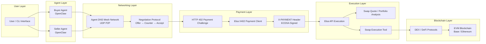

# AgentDNS

**AgentDNS** is a decentralized prototype for an **autonomous AI agent economy**. It allows software agents to discover each other over a peer‑to‑peer mesh network, negotiate prices for services, pay using **HTTP 402 micropayments (x402)**, and optionally settle transactions on blockchain through the Elsa execution stack.

The system demonstrates the full lifecycle of **agent‑to‑agent commerce**:

```
Discovery → Negotiation → Payment Challenge → Micropayment → Execution → Settlement
```

It was designed as a hackathon‑friendly architecture demonstrating autonomous economic behavior between AI agents.

---

# Core Concept

Traditional APIs rely on:

* API keys
* subscriptions
* centralized billing

AgentDNS introduces a new model where **AI agents pay per request automatically**.

Example flow:

1. Buyer agent requests a service.
2. Seller agent negotiates price.
3. Seller responds with **HTTP 402 Payment Required**.
4. Buyer signs a payment using a crypto wallet.
5. Service executes and optionally settles on-chain.

---

# Features

## Agent Discovery (P2P Mesh)

Agents discover each other over a **UDP peer‑to‑peer mesh network**.

* no central registry
* dynamic node discovery
* LAN‑based communication

Each node broadcasts its presence and listens for other agents.

---

## Agent Negotiation Protocol

Agents negotiate service prices using a structured negotiation protocol.

Negotiation states:

```
NEGO_OFFER
→ COUNTER
→ NEGO_ACCEPT
→ PAYMENT_402_REQUIRED
→ PAYMENT_402_COMPLETED
```

Agents follow different strategies:

**Seller agent**

* starts high
* negotiates slowly

**Buyer agent**

* starts low
* searches for midpoint

---

## HTTP 402 Micropayments (x402)

Instead of API keys, services require **cryptographically signed micropayments**.

The client generates an `X-PAYMENT` header using an ECDSA wallet signature.

Example request:

```
POST /api/get_swap_quote
X-PAYMENT: signed-token
```

Payments are verified through the x402 API.

---

## Elsa Execution Layer

Payments and DeFi actions are executed using the Elsa execution infrastructure.

Capabilities include:

* wallet analysis
* token price queries
* swap quotes
* portfolio analysis
* token swaps

Execution tools can run in:

* **dry‑run mode** (safe demo)
* **live execution mode** (on‑chain swaps)

---

## Autonomous Trading Agents

Agents can act as **automated DeFi trading bots**.

Capabilities include:

* monitoring token prices
* analyzing portfolios
* suggesting yield strategies
* executing swaps

Each action may require a micropayment through the x402 protocol.

---

# System Architecture

```
User / CLI
      ↓
OpenClaw Agent
      ↓
Agent DNS Mesh Network
      ↓
Negotiation Protocol
      ↓
HTTP 402 Payment
      ↓
Elsa X402 Client
      ↓
DeFi / Blockchain
```

Layers:

| Layer            | Purpose                       |
| ---------------- | ----------------------------- |
| Agent Layer      | reasoning and decision making |
| Networking Layer | peer discovery + negotiation  |
| Payment Layer    | x402 micropayments            |
| Execution Layer  | DeFi interactions             |

```mermaid
sequenceDiagram
    participant User
    participant Buyer as Buyer Agent (OpenClaw)
    participant Mesh as Agent DNS Mesh
    participant Seller as Seller Agent
    participant Elsa as Elsa X402 Client
    participant API as x402 API
    participant Chain as Blockchain / DeFi

    User->>Buyer: Start Trade Request (Token + Amount)

    rect rgb(30,30,30)
        note right of Buyer: Phase 1 - Agent Discovery
        Buyer->>Mesh: Broadcast presence
        Mesh-->>Seller: Peer discovered
    end

    rect rgb(40,40,40)
        note right of Buyer: Phase 2 - Negotiation
        Buyer->>Seller: NEGO_OFFER
        Seller-->>Buyer: COUNTER
        Buyer->>Seller: NEGO_ACCEPT
    end

    rect rgb(50,50,50)
        note right of Seller: Phase 3 - Payment Challenge
        Seller->>Buyer: HTTP 402 Payment Required
    end

    rect rgb(60,60,60)
        note right of Buyer: Phase 4 - Micropayment
        Buyer->>Elsa: Generate X-PAYMENT Header
        Elsa->>API: Submit Signed Payment
        API-->>Elsa: Payment Verified
    end

    rect rgb(70,70,70)
        note right of Seller: Phase 5 - Execution
        Seller->>Chain: Execute Swap / Service
        Chain-->>Seller: Transaction Hash
    end

    rect rgb(80,80,80)
        note right of System: Phase 6 - Settlement
        Seller-->>Buyer: PAYMENT_402_COMPLETED
        Buyer-->>User: Trade Successful
    end
```

---

# Project Structure

```
.
├── agent-dns-server.js
├── agent-dns-openclaw-integration.js
├── lib
│   ├── ElsaX402PaymentClient.js
│   ├── OpenClawAgent.js
│   └── P2PMeshNetwork.js
├── cli
│   └── index.js
├── routes
│   └── trade.js
└── utils
    └── encryption.js
```

---

# Installation

### Requirements

* Node.js 18+
* npm or yarn

Clone the repository:

```
git clone <repo-url>
cd axylossss
npm install
```

---

# Environment Variables

Create a `.env` file:

```
PORT=8080
MESH_PORT=9999
AGENT_ID=agent1

AES_MESH_KEY=32BYTE_SECRET

ELSA_API_BASE=https://x402-api.heyelsa.ai
ELSA_PRIVATE_KEY=YOUR_PRIVATE_KEY

ELSA_ENABLE_EXECUTION_TOOLS=false
```

Important:

* never commit private keys
* enable execution tools only when ready for live transactions

---

# Running the System

Start the seller node:

```
npm run seller
```

Start the buyer node:

```
npm run buyer
```

Run the interactive CLI:

```
npm run cli
```

Example CLI command:

```
propose trade WETH 1
```

---

# Example Negotiation Flow

```
Seller: Offer $2600
Buyer: Counter $2400
Seller: Counter $2500
Buyer: Accept

→ HTTP 402 Payment Required
→ Payment Signed
→ Payment Verified
→ Swap Executed
```

---

# API Endpoints

### Health Check

```
GET /health
```

---

### Get Token Price

```
GET /price/:token
```

Example:

```
GET /price/WETH
```

---

### Portfolio Analysis

```
GET /portfolio
```

---

### Propose Trade

```
POST /trade/propose
```

Example payload:

```
{
  "service": "swap",
  "pair": "USDC/WETH",
  "amount": 100
}
```

---

### Execute Trade

```
POST /trade/execute
```

---

### Natural Language Command

```
POST /openclaw/command
```

Example:

```
"check weth price"
```

---

# Demo Mode

For hackathon demos the system includes **fallback logic**.

If external APIs fail:

* mock prices are returned
* swaps run as dry‑runs
* responses return `{ status: "demo mode" }`

This ensures the demo never crashes.

---

# Security Notes

* private keys must never be committed
* AES mesh encryption protects peer traffic
* payment signatures prevent spoofing
* rate limits protect budgets

---

# Future Improvements

Potential upgrades:

* integrate real LLM reasoning
* add agent reputation systems
* implement on‑chain service registry
* create agent marketplace UI
* add decentralized identity for agents

---

# Example Use Cases

AgentDNS can enable:

* AI trading bots negotiating execution fees
* decentralized API marketplaces
* autonomous DeFi portfolio managers
* agent‑to‑agent service markets

---

# Contributing

1. Fork the repository
2. Create a feature branch
3. Submit a pull request

---

# License

MIT License

---

# Summary

AgentDNS demonstrates a new internet primitive:

**autonomous agents that can discover, negotiate, pay, and transact without humans.**

It combines:

* P2P networking
* negotiation protocols
* HTTP 402 micropayments
* blockchain execution

into a working prototype of an **AI‑driven economic network.**
